# 🧮 Push_Swap | 42 School Project

### **Sort Like a Mechanical Turk - Fast, Efficient, and Memory-Safe** 🔄  


  

  
  

  


---

## 🧩 Project Structure  
### **Code Architecture**  
```
├── checker_linux          # Linux checker binary  
├── checker_Mac            # macOS checker binary  
├── Makefile               # Builds push_swap + checker  
├── moves/                 # Core stack operations  
│   ├── pushing.c          # pa/pb logic (push elements between stacks)  
│   ├── rotating.c         # ra/rb/rr logic (rotate stacks)  
│   ├── rrotating.c        # rra/rrb/rrr logic (reverse rotate stacks)  
│   └── swaping.c          # sa/sb/ss logic (swap top elements)  
├── parsing/               # Input handling and validation  
│   ├── libft_tools.c      # Basic string and stack utilities (e.g., ft_strlen, stack_length)  
│   ├── libft_tools1.c     # Extended string utilities (e.g., ft_strdup, ft_strlcpy)  
│   ├── split.c            # Custom ft_split implementation (split arguments into tokens)  
│   ├── validating.c       # Input validation (e.g., syntax_error, error_duplicate)  
│   └── validating2.c      # Advanced input validation (e.g., split_args, free_strs)  
├── push_swap.c            # Main program logic (entry point for push_swap)  
├── push_swap.h            # Header file (defines structs, prototypes, and macros)  
├── src_checker/           # Checker program (validates sorting instructions)  
│   ├── checker.c          # Main checker logic (reads and executes commands)  
│   ├── checker.h          # Checker header file  
│   ├── execute_commands.c # Executes commands (e.g., sa, pb, rr)  
│   ├── get_next_line.c    # Reads commands line by line from stdin  
│   ├── get_next_line_utils.c # Helper functions for get_next_line  
│   └── libft_tools_4checker.c # Custom libft tools for checker (e.g., ft_split, ft_strncmp)  
├── tools/                 # Stack utilities and helper functions  
│   ├── initialiase_a_2_b.c # Initializes nodes for moving from A to B (cost analysis)  
│   ├── initialiase_b_2_a.c # Initializes nodes for moving from B to A (cost analysis)  
│   ├── stack_helpers.c    # Basic stack utilities (e.g., stack_sorted, find_min_node)  
│   └── stack_helpers2.c   # Advanced stack utilities (e.g., append_node, set_cheapest_node)  
└── turkalgo/              # Core sorting algorithm  
    ├── three_sort.c       # Optimized sorting for 3 elements (e.g., sort_three)  
    └── turk_sort.c        # Main sorting logic (e.g., turk_sort, move_a_2_b, move_b_2_a)   
```

---

## 🎯 Project Overview

## 🌟 Overview  
Push_Swap is a **highly optimized stack-sorting algorithm** that manipulates two stacks (`A` and `B`) using only 11 operations. This project demonstrates mastery of **algorithm design**, **memory management**, and **error handling**, achieving **125/100** with full test compliance.  

### Core Objectives
- Sort integers using two stacks with minimal operations  
- Develop an efficient algorithm within specific move constraints  
- Implement robust error handling and memory management  
- Create a separate checker program for validation  

**Key Features**:  
- 🚀 **Blazing Speed**: Sorts 100 numbers in ≤700 moves, 500 numbers in ≤5500 moves.  
- 🛡️ **Robust Validation**: Handles invalid inputs, duplicates, and edge cases flawlessly. "They Go_Crazy on this believe me"  
- 🧠 **Hybrid Algorithm**: Combines chunking, cost analysis, and smart rotations.  
- 📊 **Visual Debugging**: Compatible with advanced visualizers for real-time tracking.  

---

## 🧮 Algorithm Deep Dive

### chart of the Program


----

### chart of the Turk Algorithm mechanics

```mermaid
%%{init: {'theme': 'base', 'themeVariables': { 'primaryColor': '#fff3e0', 'edgeLabelBackground':'#fffaf0'}}}%%
flowchart TD
    subgraph TurkAlgorithm["Mechanical Turk Algorithm"]
        direction TB
        
        Start[("Start")] --> InitStacks
        InitStacks[Initialize Stack A with input] --> Phase1
        
        subgraph Phase1["Phase 1: Strategic Splitting"]
            direction TB
            P1A{Push first 2 elements} -->|pb| P1B
            P1B[Keep pushing elements from A to B] --> P1C{"Elements left in A ≤ 3?"}
            P1C -->|No| P1B
            P1C -->|Yes| P1D[Sort remaining 3 elements]
        end

        subgraph Phase2["Phase 2: Cost-Based Merging"]
            direction TB
            P2A[For each element in A] --> P2B
            P2B[Find target position in B] --> P2C
            P2C[Calculate rotation costs:\na_cost + b_cost - combined_moves] --> P2D
            P2D[Select cheapest node] --> P2E
            P2E[Execute optimal rotations:\nRR/RRR when possible] --> P2F
            P2F[Push element to B] --> P2G{More in A?}
            P2G -->|Yes| P2A
            P2G -->|No| Phase3
        end

        subgraph Phase3["Phase 3: Final Merge"]
            direction TB
            P3A[Find target in A for each B element] --> P3B
            P3B[Calculate reverse rotation costs] --> P3C
            P3C[Push elements back to A] --> P3D
            P3D[Align smallest element on top] --> End
        end

        Phase1 --> Phase2
        Phase2 --> Phase3
    end

    classDef phase fill:#ffe0b2,stroke:#ffab40;
    classDef decision fill:#c8e6c9,stroke:#2e7d32;
    classDef operation fill:#bbdefb,stroke:#1976d2;
    
    class Phase1,Phase2,Phase3 phase
    class P1C,P2G decision
    class P1B,P1D,P2B,P2C,P2E,P2F,P3A,P3B,P3C,P3D operation

    style TurkAlgorithm stroke-width:2px,stroke:#ef6c00
```



**Key Algorithm Components:**

1. **Cost Calculation Formula:**
```python
Total Cost = (a_rotations + b_rotations) - combined_moves
```
- `a_rotations`: Rotations needed in stack A
- `b_rotations`: Rotations needed in stack B
- `combined_moves`: Simultaneous RR/RRR operations possible

1. **Target Selection Logic:**
```
If element > max(B) → target = min(B)
If element < min(B) → target = max(B)
Else → closest smaller value in B
```

1. **Rotation Optimization:**
- Prefer combined rotations (RR/RRR) when:
  - Both elements above/below median
  - Rotation directions match

1. **Critical Path Highlights:**
- **Smart Initial Split:** First 2 elements pushed without checks "this will prevemt segfault in bonus part;"
- **Three Sort Magic:** Special optimized sort for last 3 elements
- **Cost Matrix:** Maintains rotation cost for every element
- **Reverse Merge:** Precision placement when moving back to A

**Visual Guide:**
- **Orange Boxes:** Main algorithm phases
- **Green Diamonds:** Decision points
- **Blue Rectangles:** Core operations
- **Arrows:** Data flow direction

This flowchart shows the algorithm's three-phase approach with cost optimization at its core, demonstrating why it's more efficient than traditional sorting methods for this constrained stack environment.

---

### 🎭 The Mechanical Turk Algorithm
Named after the 18th-century "automaton" chess player, this algorithm mimics strategic decision-making through **cost-based optimizations** and **chunking**.  
Curious about the name? Check out this fascinating history! --> [Scam Or Not?](https://www.youtube.com/watch?v=Xosn4ManeD4) 🎪  

### Operation Set
| Operation | Description | Effect |
|-----------|-------------|--------|
| sa | Swap A | Swaps first 2 elements of stack A |
| sb | Swap B | Swaps first 2 elements of stack B |
| ss | sa + sb | Performs both swaps simultaneously |
| pa | Push A | Moves top element from B to A |
| pb | Push B | Moves top element from A to B |
| ra | Rotate A | Shifts up all elements of A by 1 |
| rb | Rotate B | Shifts up all elements of B by 1 |
| rr | ra + rb | Performs both rotations |
| rra | Reverse Rotate A | Shifts down all elements of A by 1 |
| rrb | Reverse Rotate B | Shifts down all elements of B by 1 |
| rrr | rra + rrb | Performs both reverse rotations |

### 🔥 Algorithm Breakdown

#### Phase 1: Strategic Splitting 🎯
```c
// Push first two elements to B (like sending scouts ahead! 🕵️)
pb(b, a);
pb(b, a);
```

#### Phase 2: Sort Three 🎲
```c
void sort_three(t_stack_node **a) {
    // Simple yet effective - like a perfect card trick! 🎴
    if ((*a)->value > (*a)->next->value) sa(a);
    if (last_node(*a)->value < (*a)->value) rra(a);
}
```

#### Phase 3: Cost-Based Merging 🧮
Like a chess grandmaster, we:
1. Find each element's target position  
2. Calculate optimal rotation combinations  
3. Execute moves with surgical precision  

#### Phase 4: Final Polish ✨
Rotate until the smallest element is on top - like aligning stars! ⭐  

---

## 🚀 Installation & Usage

### Building the Project
```bash
make          # Build push_swap  
make bonus    # Build checker  
```

### Basic Usage
```bash
# Sort numbers
./push_swap 4 67 3 87 23

# Validate sorting
ARG="4 67 3 87 23"; ./push_swap $ARG | ./checker_linux $ARG

# Count moves
./push_swap $ARG | wc -l
```

### Advanced Testing
```bash
# Generate random numbers
ARG=$(ruby -e "puts (1..100).to_a.shuffle.join(' ')")

# Test with visualization
./push_swap $ARG | ./visualizer

# Memory check
valgrind --leak-check=full ./push_swap $ARG
```

---
# Push_Swap: A Comprehensive Guide to Efficient Stack Sorting "Detailed"

## Introduction

Push_Swap is an algorithmic project that challenges us to sort data using two stacks with a limited set of operations. The goal is to develop a program that calculates and outputs the smallest sequence of operations needed to sort a random list of integers in ascending order using two stacks (A and B).

## Core Concepts

### Stack Structure
- **Stack A**: Initially contains all input numbers; the first element is considered the top
- **Stack B**: Initially empty, used as auxiliary storage
- Both stacks are implemented as linked lists for efficient operations

### Available Operations

1. **Push Operations**
   - `pa`: Push top element from B to A
   - `pb`: Push top element from A to B

2. **Swap Operations**
   - `sa`: Swap top two elements of A
   - `sb`: Swap top two elements of B
   - `ss`: Perform both `sa` and `sb` simultaneously

3. **Rotate Operations**
   - `ra`: Rotate stack A up (first element becomes last)
   - `rb`: Rotate stack B up (first element becomes last)
   - `rr`: Perform both `ra` and `rb` simultaneously

4. **Reverse Rotate Operations**
   - `rra`: Rotate stack A down (last element becomes first)
   - `rrb`: Rotate stack B down (last element becomes first)
   - `rrr`: Perform both `rra` and `rrb` simultaneously

## Algorithm Design

### Data Structure

The algorithm uses a linked list structure with enhanced node properties:

```c
typedef struct s_stack_node {
    int value;           // The actual number
    int index;          // Position in sorted sequence (1 to n)
    int position;       // Current position in stack
    int target_pos;     // Target position in other stack
    int cost_a;         // Cost of operations in stack A
    int cost_b;         // Cost of operations in stack B
    bool above_median;  // Position relative to stack middle
    struct s_stack_node *next;
} t_stack_node;
```

### Core Algorithm Components

1. **Indexing System**
   - Convert input values to indices (1 to n) based on their sorted position
   - Makes comparison and position tracking more straightforward
   - Example: [-5, 42, 100] becomes indices [1, 2, 3]

2. **Position Tracking**
   - Continuously track each element's current position in its stack
   - Position counting starts from 0 at the top
   - Updated after every operation

3. **Cost Calculation**
   - Calculate costs for moving elements in both stacks
   - Consider both rotation directions (up/down)
   - Track combined costs for simultaneous operations

## Sorting Algorithm

### Small Stack Sorting (≤3 Elements)

For three or fewer elements, use a simplified approach:

1. **Two Elements**: Single swap if needed
2. **Three Elements**: Maximum of two operations needed
   ```
   Case 1: [1,2,3] → No action needed
   Case 2: [2,1,3] → sa
   Case 3: [2,3,1] → rra
   Case 4: [3,1,2] → ra
   Case 5: [3,2,1] → sa + rra
   Case 6: [1,3,2] → sa + ra
   ```

### Large Stack Sorting (>3 Elements)

#### Phase 1: Initial Distribution
1. Push all elements except three to stack B
2. Sort remaining three elements in stack A
3. Use median-based chunking for initial rough sorting

#### Phase 2: Optimal Element Selection
1. For each element in B:
   - Calculate current position
   - Determine target position in A
   - Compute cost of movement
   - Consider both rotation directions

#### Phase 3: Cost Calculation
1. For each element, calculate:
   - Cost to move to top of B (`cost_b`)
   - Cost to position stack A (`cost_a`)
   - Total cost = |cost_a| + |cost_b|

#### Phase 4: Element Movement
1. Select element with lowest total cost
2. Execute rotation sequences
3. Use combined operations (rr/rrr) when possible
4. Push element to correct position

#### Phase 5: Final Alignment
1. After B is empty, rotate A until smallest element is at top
2. Ensure stack is in ascending order

## Implementation Details

### Target Position Calculation

For each element in B, find its target position in A:
1. If element's index is larger than A's largest → target is A's smallest
2. Otherwise → target is closest larger index in A
3. Track position relative to median for optimization

### Cost Optimization

1. **Rotation Direction**
   - Above median: Use regular rotation
   - Below median: Use reverse rotation
   - Store reverse rotations as negative costs

2. **Combined Operations**
   - Use `rr` when both stacks rotate up
   - Use `rrr` when both stacks rotate down
   - Saves operations compared to individual rotations

## Performance Metrics

### Operation Limits for Maximum Score
- 3 numbers: ≤3 operations
- 5 numbers: ≤12 operations
- 100 numbers: ≤700 operations (5 points)
- 500 numbers: ≤5500 operations (5 points)

### Optimization Techniques
1. Pre-sort elements during initial push to B
2. Use median tracking for efficient rotation direction
3. Leverage combined operations whenever possible
4. Calculate and compare total costs for all possible moves

## Error Handling

1. **Input Validation**
   - Check for non-integer values
   - Detect duplicate numbers
   - Verify against INT_MIN/INT_MAX limits

2. **Edge Cases**
   - Handle empty input
   - Process single number cases
   - Manage already sorted sequences

## Testing Strategies

1. **Basic Testing**
   - Verify individual operations
   - Test error handling
   - Check edge cases

2. **Performance Testing**
   - Use random number generators
   - Test with maximum input sizes
   - Verify operation counts

3. **Edge Case Testing**
   - Test with negative numbers
   - Check boundary values
   - Verify duplicate handling

## Conclusion

This implementation of Push_Swap combines positional awareness with cost-based decision making to create an efficient sorting algorithm. By carefully tracking positions, calculating costs, and optimizing operations, it achieves performance well within the project requirements while maintaining code clarity and maintainability.

---

## 📊 Performance Metrics
| Stack Size | Min Allowed | This Project | Efficiency |  
|------------|-------------|--------------|------------|  
| 100        | 700         | 580-650      | 100% ✅     |  
| 500        | 5500        | 4900-5200    | 100% ✅     |  


---

### Memory Safety
```bash  
valgrind --leak-check=full ./push_swap 42 21  # Zero leaks guaranteed  
```

---

## 📚 Resources
- **Algorithm Inspired From**: [Medium Article by Ayogun](https://medium.com/@ayogun/push-swap-c1f5d2d41e97)  
- **Visualizers**:  
  - [Video Explanation Of the Algorithm ](https://www.youtube.com/watch?v=wRvipSG4Mmk)  
  - [Interactive Push_Swap Visualizer](https://windowdong11.github.io/push_swap_visualizer/)  
  - [Visualizer](https://github.com/o-reo/push_swap_visualizer)  

---

## 👨‍💻 Author
**Youssef Mazini**  
[](https://profile.intra.42.fr/users/ymazini)  
[](https://github.com/yomazini)  

```c  
// "Simplicity is the ultimate sophistication." - Leonardo da Vinci  
```

*Made with 💖, ☕, and probably too many stack rotations! Remember: in Push_swap, we don't make mistakes, we have happy little sorting accidents! 🎨*  "deal with it; GL"
